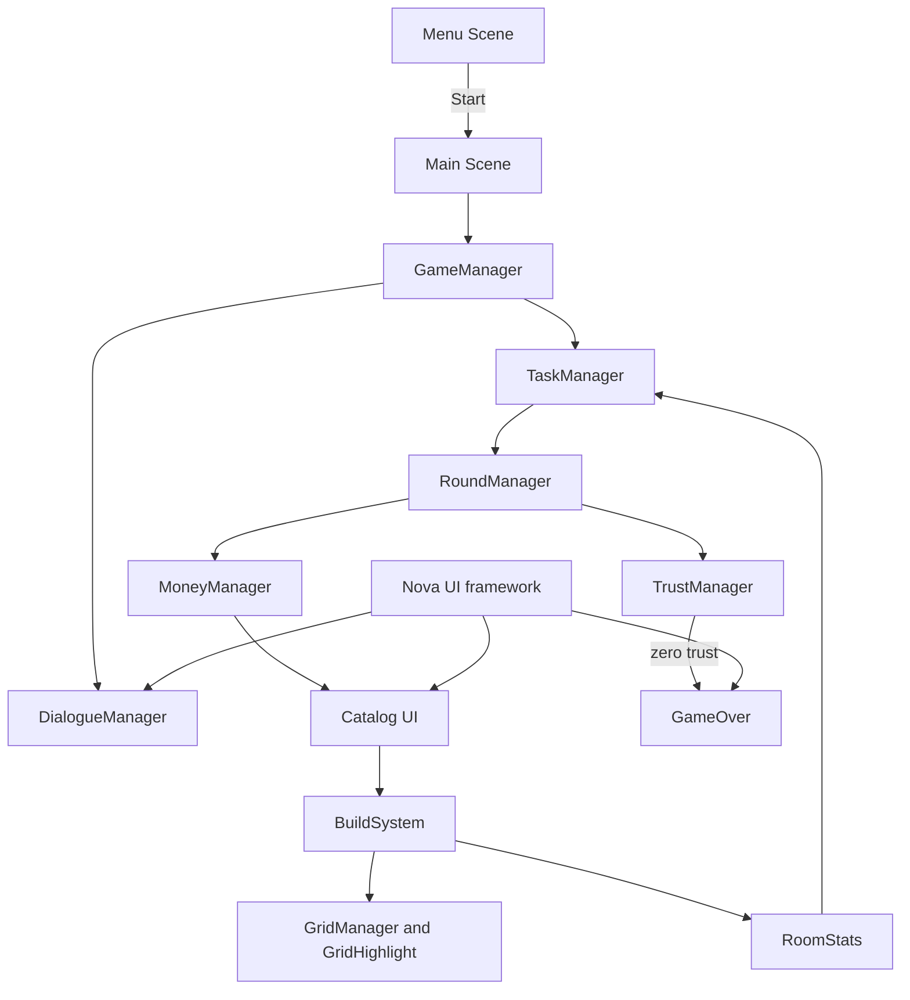

# Room For One More

## Project Overview

Room For One More is a Unity room-design game. The player helps Grandma(Mrs. Darwin) furnish a cramped 9x9 room while balancing a limited budget, room traits, randomized tasks, and Grandma's trust.

The project is built with Unity `6000.2.6f2`. Game-authored code lives mainly under `Assets/Resources/1. C# Scripts`.

<table>
  <tr>
    <td></td>
    <td></td>
  </tr>
</table>

<br><br>
[](https://maximillian520.itch.io/room-for-one-more)

## Contributors

| Contributor | Role | Contribution |
|---|---|---|
| **Natanael Kevin Kurniawan** | **Lead Game Programmer & UI/UX Designer** | Led the implementation of the game's core gameplay loop and primary gameplay systems. Responsible for the majority of the game's scripting and also designed and implemented the overall UI/UX and player interaction flow. |
| **Maximillian Kenas** | **Game Programmer & Game Designer** | Supported gameplay programming and helped resolve technical challenges throughout development. Also contributed to gameplay design decisions and helped refine mechanics and overall player experience. |
| **Delvin Susilo** | **Lead Game Designer** | Originated the game's core concept and established its overall gameplay direction. Structured the game's progression, sequence of events, and overall player experience. |
| **Dave Franklin Lewandi** | **3D & 2D Game Artist** | Created the game's complete voxel-based 3D environment and object assets, while also producing the 2D UI iconography used throughout the game's interface. |

## Time Spent: 7 Days / ~96 Work Hours

## Features

- Data-driven furniture catalog with costs, sizes, prefabs, categories, icons, and trait contributions.
- Grid-based furniture placement with previews, occupied-cell validation, rotation, selection, and removal.
- Room statistics for Charisma, Comfort, and Functionality.
- Randomized main and extra tasks based on furniture counts, furniture types, and stat thresholds.
- Round-based trust and money progression, including optional task rewards and task refreshes.
- Dialogue presentation with typewriter text, character expressions, idle dialogue, and skip support.
- Menu, settings, credits, catalog filters, money feedback, trust display, and game-over flow.

## Gameplay Loop

1. Start from `Menu Scene`; `MenuManager` loads `Main Scene`.
2. The opening dialogue introduces the 9x9 room and gives the player 1,500 money.
3. `TaskManager` assigns randomized main and extra tasks.
4. Buy furniture from the catalog and place or rotate it on the grid.
5. Furniture updates room counts and the Charisma, Comfort, and Functionality stats.
6. Complete tasks, optionally refresh a task list for 50 money, then end the round.
7. Completed main tasks add 10 trust; failed main tasks remove 20 trust. Completed extra tasks pay their coin reward.
8. Trust starts at 50 out of 100. Reaching zero opens the game-over flow; otherwise the next round receives new tasks.

## Project Structure



Important directories:

```text
Assets/
  Resources/
    1. C# Scripts/       Game systems, UI, data, furniture, grid, and tasks
    4. Furniture Data/   FurnitureData assets and furniture definitions
    5. Task Data/        Trait and furniture task assets
  Scenes/                Menu Scene, Main Scene, Test Scene, Backup Scene
  Nova/                  Embedded Nova UI framework and sample UI controls
  InputSystem_Actions.inputactions
Packages/                Unity package manifest and lock file
ProjectSettings/         Unity version, build scenes, and project settings
```

`Menu Scene` and `Main Scene` are enabled in the build settings. `Test Scene` and `Backup Scene` are present but are not enabled there.

## Important Systems / Architecture

- **Game flow:** `GameManager` sequences the opening dialogue, initializes the starting budget, assigns tasks, and starts the end-game sequence.
- **Building:** `CatalogEditor` and `FurnitureData` provide catalog data; `BuildSystem` handles placement; `GridManager` creates the 9x9 grid; `FurnitureController` handles placed-item interaction and selling.
- **Room state:** `RoomStats` tracks individual furniture counts, category counts, and the three room traits.
- **Tasks and rounds:** `TaskData` subclasses define furniture-count, furniture-type, and stat-threshold objectives. `TaskManager` assigns and evaluates them, while `RoundManager` advances rounds.
- **Progression:** `MoneyManager` handles the budget and `TrustManager` clamps trust between zero and its 100-point maximum.
- **Presentation:** `DialogueManager`, `CatalogUI`, `TaskUI`, `MoneyUI`, `TrustUI`, and `GameOver` provide the player-facing flow using Nova UI components.

## Development Notes

- Open the project with Unity `6000.2.6f2`.
- The main runtime dependencies include URP `17.2.0`, Input System `1.14.2`, AI Navigation `2.0.9`, ProBuilder `6.0.8`, Timeline `1.8.9`, and Unity Test Framework `1.6.0`.
- Editor context-menu helpers can generate the grid, populate furniture data, populate task assets, and assign catalog items.
- Furniture placement uses left click to confirm, right click or Escape to cancel, and `R` to rotate. The project also defines `N` for dialogue skip, `1`/`2`/`3` for information panels, and `Ctrl+M`/`Ctrl+T` debug shortcuts for money/trust.
- The repository includes an MIT `LICENSE`.
